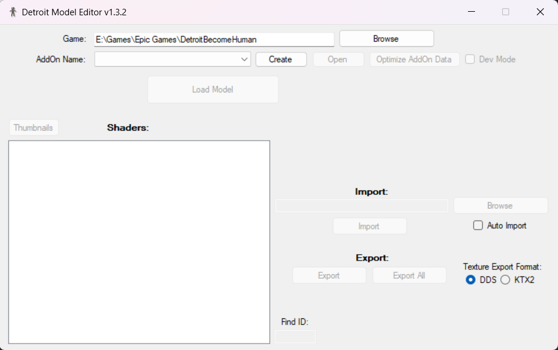
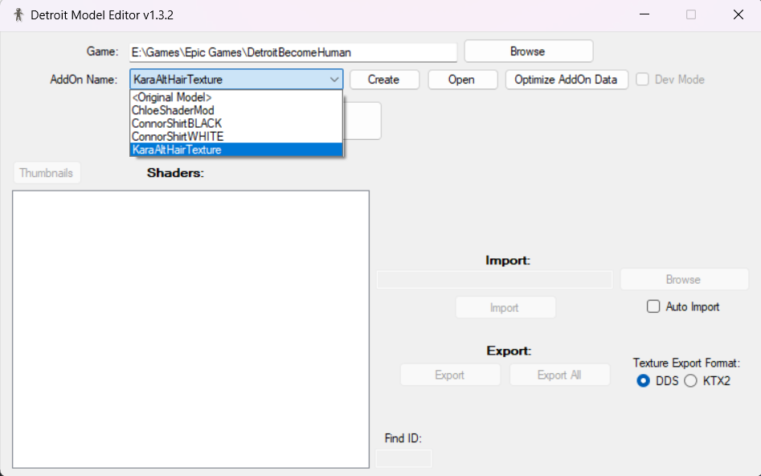

# Model Editor Readme

### Setup
Make sure you put the tool somewhere safe and where you have space to work on textures. Enter your game directory like this: 

This tool follows the AddOn flow that is explained here: [AddOn Overview](https://github.com/dragonbane-projects/Detroit-Tool-Docs/blob/mod-addOnOnly/AddOn%20Overview.md)  
The benefit of using that system is that the vanilla game files remain untouched. And that you can have multiple AddOns around that e.g. mod Connor, so you could have an Addon called Connor_WhiteHair and Connor_RedHair for example. Of course you can't have both of them active at the same time, but you can easily switch between them, which is a great bonus. AddOns can be easily shared with people too and they can be quickly removed, disabled or re-enabled.

### Overview
As for the model editor, here you get the list of AddOns to choose from where you want to put your modded textures and shaders: 

The list will show all the AddOns you have plus a special \<Original Model\> entry that appears at the top always. At the start you likely won't have any AddOns, as such the list will only show the \<Original Model\> entry.
Choosing that entry and loading a model will always pull it from the vanilla game files.
If you select an AddOn it will pull it from the AddOn if it exists there. 

So when you first want to mod a model, pull the original. Then you can use the **Create** button to make a new AddOn which you can then select and import your textures to that. By default new AddOns are not enabled, so when you create a new one, remember to enable it once in the [AddOnsManager](https://github.com/dragonbane-projects/Detroit-Tool-Docs/blob/mod-addOnOnly/AddOn%20Overview.md).
Then if you later want to make adjustments, ensure you load your model from the AddOn again to preserve your modded state for your new imports.

**Load Model** loads the model. The search works either via text e.g. "Connor" or model ID e.g. "1551" for CONNOR_INT02.

After you load a model the list will show the list of shaders, with best guessed names (which can be wrong if I haven't tested the model that well). If you want to rename these entries, you can do so after loading a model once. You find the names in the _modelCache folder where the app .exe is. You can rename these entries however you want if my tool does a mistake or just because you prefer a different name for a shader. 

### Export
All textures in Detroit are driven by shaders, so that's the central link. You can either select one e.g. "Head" and then hit **Export** or **Export All** to get them all. It will extract the shader and all the used textures by said shader. Exported original models appear in an "Export/_Original" folder (next to where the app .exe is) to separate them from AddOn models you can also extract if you for whatever reason need your modded files back from that and dont have your originals anymore (extracted AddOn models appear in an "Export/\<AddOnName\>" folder).

You can extract textures either in the DDS format or in the KTX2 format. DDS is obviously more widely supported, KTX2 is specifically for Vulkan and supports some additional nuances DDS doesn't, which is only relevant for some nieche formats, but nevertheless I made it an option (explanation for that format here: [KTX2 Explanation](https://doc.babylonjs.com/features/featuresDeepDive/materials/using/ktx2Compression)).
The NVIDIA Texture Tool can display and generate both DDS and KTX2.

In the dumped files you can browse the DDS or KTX2 textures as usual. Each texture also has an identical named JSON file alongside it containing some texture information that can be edited (usually only needed for some very nieche advanced cases).

It's important to not remove the ID components from the filenames e.g. Diffuse_DiffuseColor_Uv0_s18_2137_138254.dds is the CONNOR_INT02 central Head Diffuse. You can rename this "Diffuse_DiffuseColor_Uv0_s18" to whatever you like, but you need to keep the final "_2137_138254.dds" part at the end. Even more importantly, when you do rename it, you also need to rename the JSON file with the same name, so the link remains intact.

That's about all that is important, otherwise you can edit textures however you want as long as you export them into a compatible DDS/KTX2 format with mipmaps included (I won't generate them to allow greater flexibility). So make sure to use the "Generate Mipmaps" in the GIMP exporter or the equivalent in Photoshop. In NVIDIA texture tools it's called "Regenerate Mipmaps" and should also be checked. Paint.NET is another great tool to author DDS files.

### Import
To import a texture drag the DDS/KTX2 or the same named JSON file onto the Import bar and hit **Import**. This file is then imported into your AddOn. There is no issue with shared textures between characters, so nothing you need to watch out for in particular when doing this.

### Real Time Editing
Textures and shaders can be edited and previewed in nearly real time if you happen to have my Ingame Mod Menu at a high enough tier level to have the **Model Showroom** feature included. Read up how that feature works here: [Model Showroom](https://github.com/dragonbane-projects/Detroit-Tool-Docs/blob/mod-menu-creator/2.%20Readme%20Mod%20Menu.md#model-showroom).

Once you are in this special development environment and have your target character spawned, you can hot reload any textures/shaders you import. To that end the character will pull data from a special AddOn. To import into this AddOn from within the Model Editor, you need to check the **Dev Mode** checkbox. This option will be greyed out unless you either have an original model loaded or loaded a model from an AddOn. Freshly created AddOns with no model imported yet are not supported.

Once checked, the currently loaded AddOn or original model is mirrored into the special Dev AddOn. Any imports you now perform **only** apply to this special AddOn. Any change you make can be instantly previewed after by reloading the character in the Model Showroom. I recommend combining this with the **Auto Watch** checkbox, as with that you only need to export your texture in your image program of choice and a single press of F5 in the game will show your change.

If you want to persist your changes to your actual selected AddOn, simply uncheck **Dev Mode** again. If changes were made the tool will then prompt if you wish to mirror the Dev AddOn back to your actual AddOn or discard any changes made. As such you can also use the Dev Mode as a sandbox to break things in. If you have an original model loaded, leaving Dev Mode will always discard all changes.

> [!CAUTION]
Hot reloading AddOns ***can*** be unstable. It is possible that entering Dev Mode and first reloading a model will crash the game. After you restart the game, it should now be stable for this current model. Likewise, after you are done in the Model Showroom, I recommend always rebooting the game. If you did any changes to your actual AddOn and it is currently enabled, it will most likely crash the game when you hit a chapter where it gets used until you reboot the game.

### Other Tool Features
- The **Open** button just opens the currently set AddOn folder for convenience
- **Optimize AddOn Data** re-packages the AddOn data to be as small as possible as they can bloat over time as texture data is appended for speed
- **Auto Watch** checkbox, if you have it toggled and a texture file path entered in the Import bar (by dragging a texture file on there or entering the path) and a target AddOn set, my tool will watch this file for changes and automatically trigger an import on change. So if you are currently making rapid changes, you can prep it there, minimize my tool and whenever you export in GIMP or Photoshop and overwrite this file you will hear the confirm sound once my tool picked it up and auto imported it for you
- A thumbnail viewer. After you selected a shader in the list use the **Thumbnails** button, double click the list entry or use the F1 hotkey to bring up a thumbnail view for this shader showing all of its textures. You can open multiple of these simultaneously and can easily scroll them using the mouse wheel. Clicking a thumbnail will open it in a separate bigger window and show texture info like format and resolution in the title plus the ID to easily find the actual file later. Thumbnail windows can also be closed fast using the Escape key

### Random Notes
- Importing upscaled textures, e.g. upscaling Connor's face diffuse from 2K to 4K is supported
- You can permanently remove mipmaps by not generating any and then editing the JSON info file for the texture to only include a single lodChunksInfo entry. This can be used if you want slightly higher texture quality at increased camera distance for whatever reason (as you then force the game to always use the 2K/4K texture at a slight performance loss)